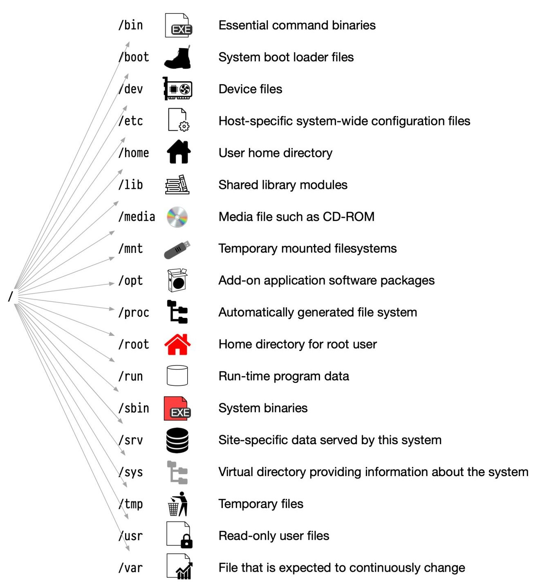

### Directory Structure

The directories help us to store the files and locate them when we need them. Also, directories are called folders as they can be assumed of as folders where files reside in the form of a physical desktop analogy. Directories can be organized in a tree-like hierarchy in Linux and several other operating systems.

The directory structure of Linux is well-documented and defined in the Linux FHS (Filesystem Hierarchy Standard). Referencing those directories if accessing them is achieved via the sequentially deeper names of the directory linked by '/' forward slash like /var/spool/mail and /var/log. These are known as paths.

The below table gives a very short standard, defined, and well-known top-level Linux directory list and their purposes:

`/ (root filesystem)`: It is the top-level filesystem directory. It must include every file needed to boot the Linux system before another filesystem is mounted. Every other filesystem is mounted on a well-defined and standard mount point because of the root filesystem directories after the system is started.

`/boot`: It includes the static kernel and bootloader configuration and executable files needed to start a Linux computer.

`/bin`: This directory includes user executable files.

`/dev`: It includes the device file for all hardware devices connected to the system. These aren't device drivers; instead, they are files that indicate all devices on the system and provide access to these devices.

`/etc`: It includes the local system configuration files for the host system.

`/lib`: It includes shared library files that are needed to start the system.

`/home`: The home directory storage is available for user files. All users have a subdirectory inside /home.

`/mnt`: It is a temporary mount point for basic filesystems that can be used at the time when the administrator is working or repairing a filesystem.

`/media`: A place for mounting external removable media devices like USB thumb drives that might be linked to the host.

`/opt`: It contains optional files like vendor supplied application programs that must be placed here.

`/root`: It's the home directory for a root user. Keep in mind that it's not the '/' (root) file system.

`/tmp`: It is a temporary directory used by the OS and several programs for storing temporary files. Also, users may temporarily store files here. Remember that files may be removed without prior notice at any time in this directory.

`/sbin`: These are system binary files. They are executables utilized for system administration.

`/usr`: They are read-only and shareable files, including executable libraries and binaries, man files, and several documentation types.

`/var`: Here, variable data files are saved. It can contain things such as MySQL, log files, other database files, email inboxes, web server data files, and much more.